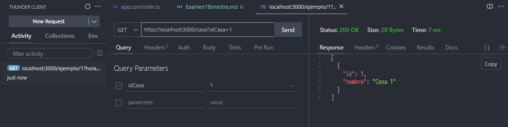
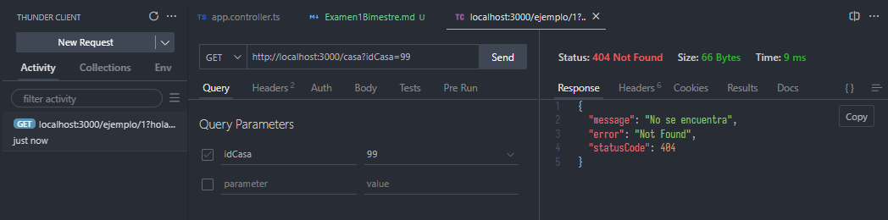

# Anderson Daniel Cango Samuisa - Examen 1er Bimestre

# Ruta `/casa`

Presione aquí para revisar el controlador:

[Ver controlador](./../src/app.controller.ts)

Esta ruta permite **obtener información de casas disponibles** a través de una solicitud HTTP `GET`.

---

## Endpoint

```
GET http://localhost:3000/casa
```

---

## Parámetros de consulta (`Query`)

| Nombre | Tipo   | Opcional | Descripción                          |
| ------ | ------ | -------- | ------------------------------------ |
| idCasa | string | Sí       | ID de la casa que se desea consultar |

---

## Ejemplos de uso

### 1. Obtener **todas** las casas

```
GET http://localhost:3000/casa
```

**Respuesta:**

```json
[
  { "id": 1, "nombre": "Casa 1" },
  { "id": 2, "nombre": "Casa 2" }
]
```


---

### 2. Obtener **una casa específica** por ID

#### ID válido (`1` o `2`)

```
GET http://localhost:3000/casa?idCasa=1
```

**Respuesta:**

```json
[{ "id": 1, "nombre": "Casa 1" }]
```



```
GET http://localhost:3000/casa?idCasa=2
```

**Respuesta:**

```json
[{ "id": 2, "nombre": "Casa 2" }]
```


---

#### ID no válido

```
GET http://localhost:3000/casa?idCasa=99
```

**Respuesta:**

```json
{
  "message": "No se encuentra",
  "error": "Not Found"
  "statusCode": 404,
}
```



---

## Código de estado HTTP

| Código | Significado        |
| ------ | ------------------ |
| 200    | Éxito              |
| 404    | Casa no encontrada |

---

## Comportamiento interno

- Si no se proporciona `idCasa`, se devuelven **todas** las casas.
- Si se proporciona un `idCasa` válido (`1` o `2`), se devuelve esa casa en un arreglo.
- Si el `idCasa` no corresponde a ninguna casa, se lanza una excepción `NotFoundException` con el mensaje `"No se encuentra"`.
